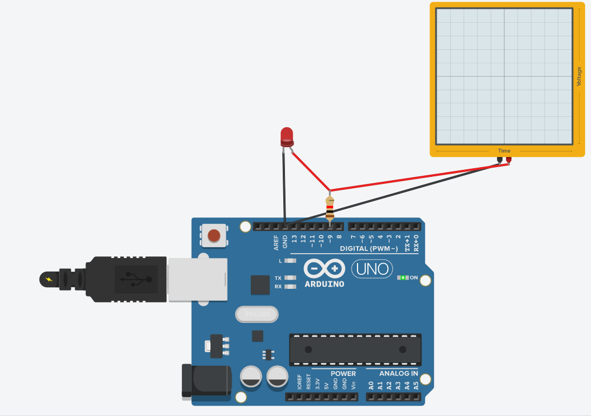

# 實作2-1

## 說明
實作2-1, analogWrite(): 並且觀查LED亮度變化是否有像"呼吸的效果"和示波器的波形有什麼關連性? (互動1), (2021-09-05)

### 電路圖

### 程式
```C
// C++ code
//
int brightness = 0;
void setup()
{
  pinMode(9, OUTPUT);
}

void loop()
{
  for (brightness = 0; brightness <= 255; brightness += 5) {
  	analogWrite(9, brightness);
    delay(30); // Wait for 1000 millisecond(s)
  }
  
  for (brightness = 255; brightness >= 0; brightness -= 5) {
  	analogWrite(9, brightness);
    delay(30); // Wait for 1000 millisecond(s)
  }
}
```
