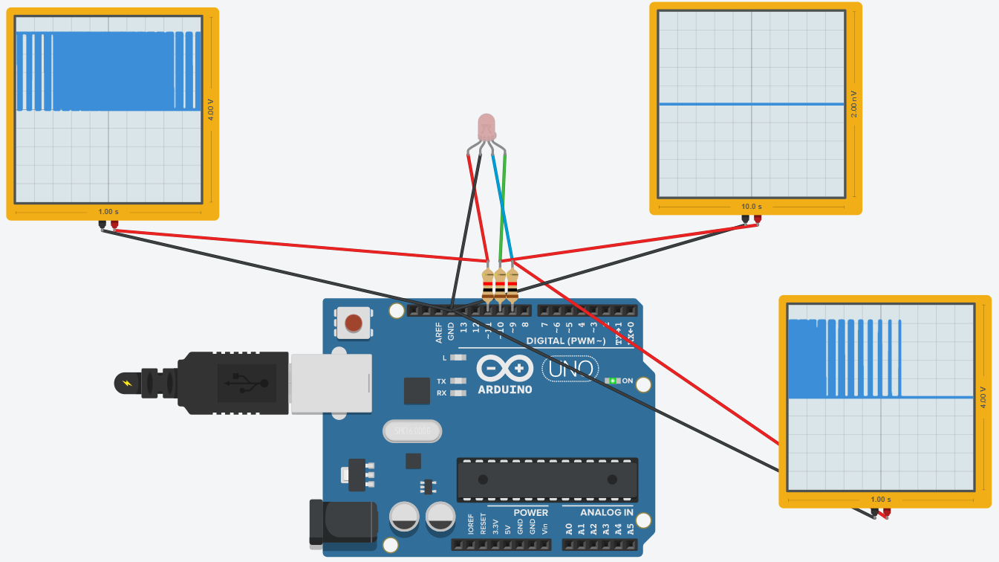

# 實作2-3

## 說明
實作2-3, 讓你的RGB LED燈全彩模組也可會"呼吸", LED顏色變化是否有像"呼吸的效果"和示波器的波形有什麼關連性? (互動3), (2021-09-05)

### 電路圖

### 程式
```C
// C++ code
//
int Red = 11;
int Green = 10;
int Blue = 9;
int i = 0;
int j = 0;
void swapLED(int j, int i) {
  switch (j) {
    case 1:
    analogWrite(Red, 0);
    analogWrite(Green, i);
    analogWrite(Blue, 0);
    break;
    case 2:
    analogWrite(Red, 0);
    analogWrite(Green, 0);
    analogWrite(Blue, i);
    break;
    default:
    analogWrite(Red, i);
    analogWrite(Green, 0);
    analogWrite(Blue, 0);
    break;
  }
}

void setup()
{
  pinMode(Red, OUTPUT);
  pinMode(Green, OUTPUT);
  pinMode(Blue, OUTPUT);
}

void loop()
{
  if (j > 3) {
  	j = 0;
  }
  for (i = 1; i <= 255; i += 5) {
    swapLED(j, i);
    delay(30);
  }
  for (i = 255; i >= 1; i -= 5) {
    swapLED(j, i);
    delay(30);
  }
  j++;
}
```
