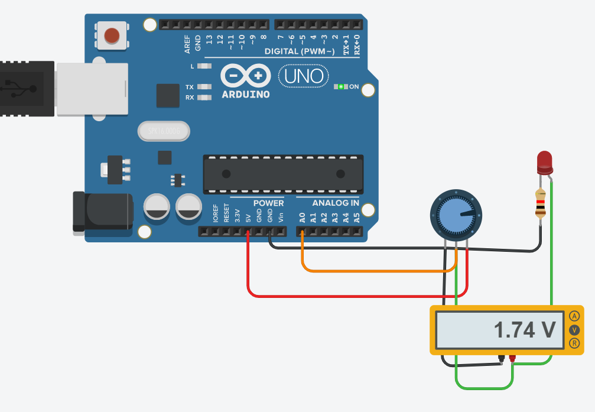

# 實作2-4

## 說明
實作2-4 analogRead(), 1024解析度 (i.e.,10-bit): 可變電阻 + 序列監視器與輸出; 當你改變可變電阻的阻值(e.g., 10K-ohm)時，序列監視器輸出的數值有什麼改變? 數值又有什麼意義呢? 可試將你的想法寫在你的GitHub Page中喔! (互動4) (2021-09-12)

### 電路圖

### 程式
```C
// C++ code
//
int sensorValue = 0;
void setup()
{
  pinMode(A0, INPUT);
  Serial.begin(9600);
}

void loop()
{
  sensorValue = analogRead(A0);
  Serial.println(sensorValue);
  delay(10);
}
```
