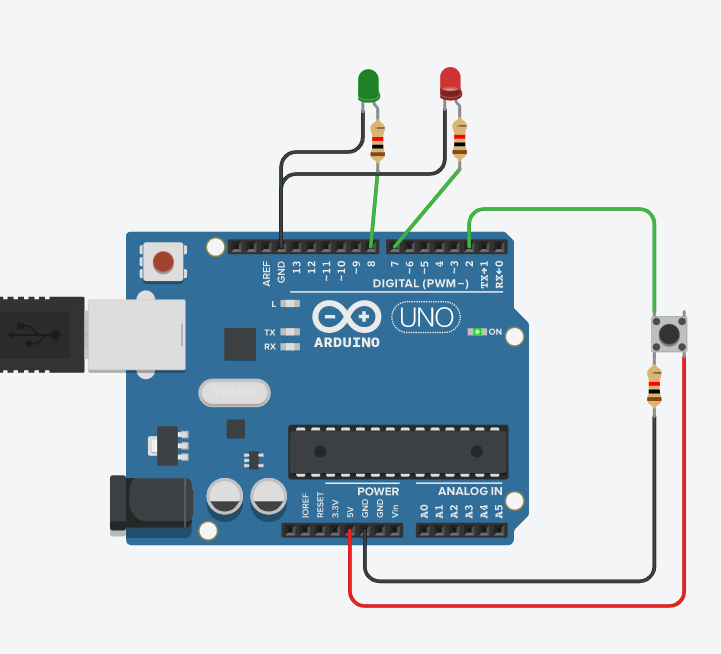

# 實作2-5

## 說明
實作2-5: 按下按鍵, Green LED亮 & Red LED滅; 放開按鍵, Green LED滅 & Red LED亮. 想要再深入的同學可以試試喔. (思考方向: digitalRead(), digitalWrite(): 按鍵 +序列輸出 + LED), (互動5) (2021-09-19)

### 電路圖

### 程式
```C
// C++ code
//
int ledR = 7;
int ledG = 8;

void setup()
{
  pinMode(ledR, OUTPUT);
  pinMode(ledG, OUTPUT);
  Serial.begin(9600);
}

void loop()
{
  int buttonState = digitalRead(2);
  if (buttonState == 0) 
  {
    digitalWrite(ledR, HIGH);
    digitalWrite(ledG, LOW);
  }
  else
  {
    digitalWrite(ledG, HIGH);
    digitalWrite(ledR, LOW);
  }
  
  delay(10);
}
```
