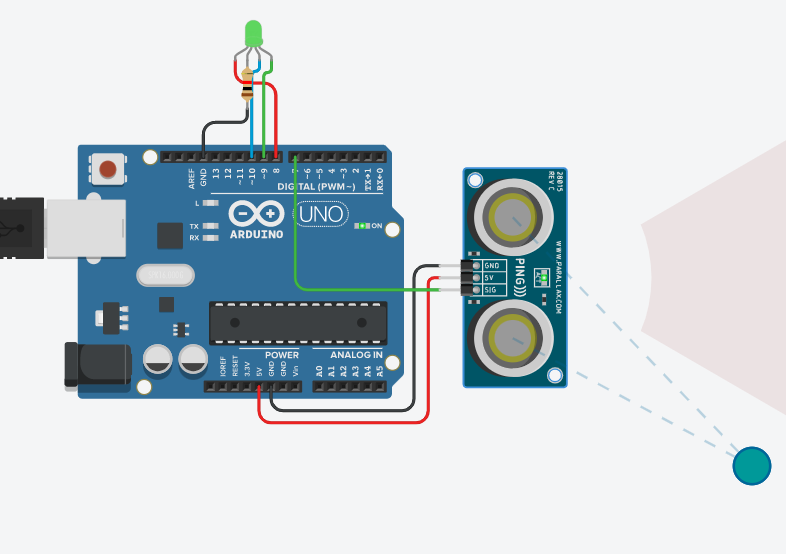

# 實作3-2

## 說明
Lab 3-2: 超音波感測器 + LED (紅色LED:亮<70cm, 緑色LED: 亮>270cm, 藍色LED:亮, 介於70cm ~ 270cm之間) + RS232 Output

### 電路圖

### 程式
```C
// C++ code
//

int inches = 0;

int cm = 0;

int ledR = 8;
int ledG = 9;
int ledB = 10;

long readUltrasonicDistance(int triggerPin, int echoPin)
{
  pinMode(triggerPin, OUTPUT);  // Clear the trigger
  
  pinMode(ledR, OUTPUT);
  pinMode(ledG, OUTPUT);
  pinMode(ledB, OUTPUT);
  
  digitalWrite(triggerPin, LOW);
  delayMicroseconds(2);
  // Sets the trigger pin to HIGH state for 10 microseconds
  digitalWrite(triggerPin, HIGH);
  delayMicroseconds(10);
  digitalWrite(triggerPin, LOW);
  pinMode(echoPin, INPUT);
  // Reads the echo pin, and returns the sound wave travel time in microseconds
  return pulseIn(echoPin, HIGH);
}

void setup()
{
  Serial.begin(9600);

}

void loop()
{
  // measure the ping time in cm
  cm = 0.01723 * readUltrasonicDistance(7, 7);
  // convert to inches by dividing by 2.54
  inches = (cm / 2.54);
  Serial.print(inches);
  Serial.print("in, ");
  Serial.print(cm);
  Serial.println("cm");
  /* 紅色LED:亮<70cm
   * 緑色LED: 亮>270cm
   * 藍色LED:亮 介於70cm ~ 270cm之間
   */
  if (cm < 70)
  {
    digitalWrite(ledR, HIGH);
    digitalWrite(ledG, LOW);
    digitalWrite(ledB, LOW);
  }
  else if (cm > 270)
  {
    digitalWrite(ledR, LOW);
    digitalWrite(ledG, HIGH);
    digitalWrite(ledB, LOW);
  }
  else 
  {
    digitalWrite(ledR, LOW);
    digitalWrite(ledG, LOW);
    digitalWrite(ledB, HIGH);
  }
  delay(100); // Wait for 100 millisecond(s)
}
```
