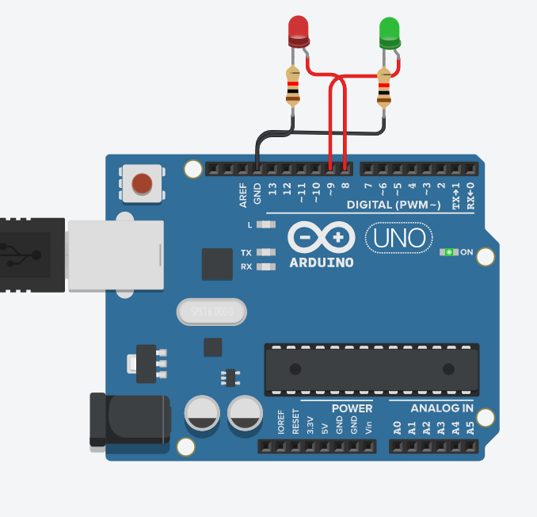

# 實作3-3

## 說明
Lab 3-3: Arudino常用的C語言程式介紹與實作

- **Summary (摘要):**

    Arduino 程式語法, 

    [Arduino 程式語法](https://www.block.tw/blog/arduino-structure/)

    

    [Arduino cheat sheet v02c.png](https://drive.google.com/file/d/1IhBpJdpYz538ZXxzAMEUX97DagqcCaOu/view?usp=sharing)

    

    

    

請使用Arudino, 通過Serial印出9X9乘法表, 計算時亮紅色LED, 綠色LED慢慢變亮亮完成時全亮, 並且紅色LED OFF, 細節可參考以下Demo作法:

### 電路圖

### 程式
// C++ code
//
int ledR = 8;
int ledG = 9;

void setup()
{
  pinMode(ledR, OUTPUT);
  pinMode(ledG, OUTPUT);
  Serial.begin(9600);
}

void loop()
{
  // 開始印99乘法表
  digitalWrite(ledG, LOW);
  digitalWrite(ledR, HIGH);
  for (int i = 1; i <= 9; i++) {
    for (int j = 1;j <= 9; j++) {
    	Serial.print(j);
      	Serial.print(" * ");
      	Serial.print(i);
      	Serial.print(" = ");
      	Serial.print(j * i);
        Serial.print("\t");
    }
    Serial.println(" ");
    analogWrite(ledG, (i * 9));
  }
  digitalWrite(ledR, LOW);
  delay(2000); 
}
```
